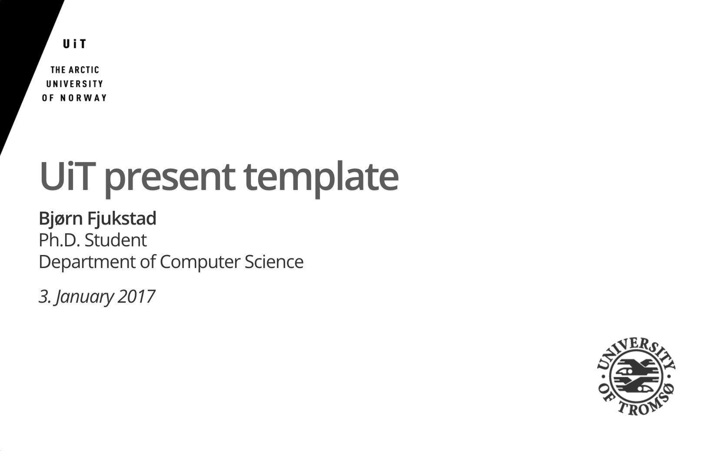

# uit-present
University of Tromsø's graphic profile to Go's [present](https://godoc.org/golang.org/x/tools/present) tool.

# Install
1. Install [go](http://golang.org)
2. Run present with the `-base` argument set to this directory. (`present
   -base=/where/you/cloned/me`)
